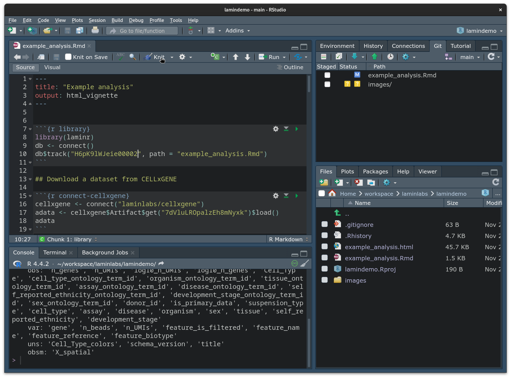
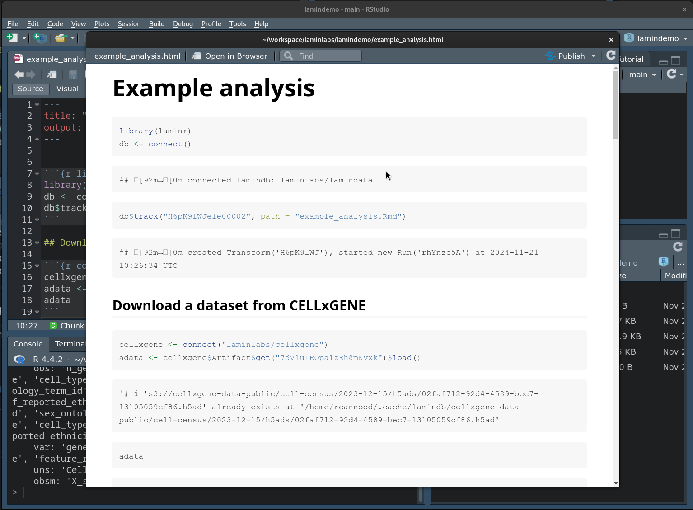
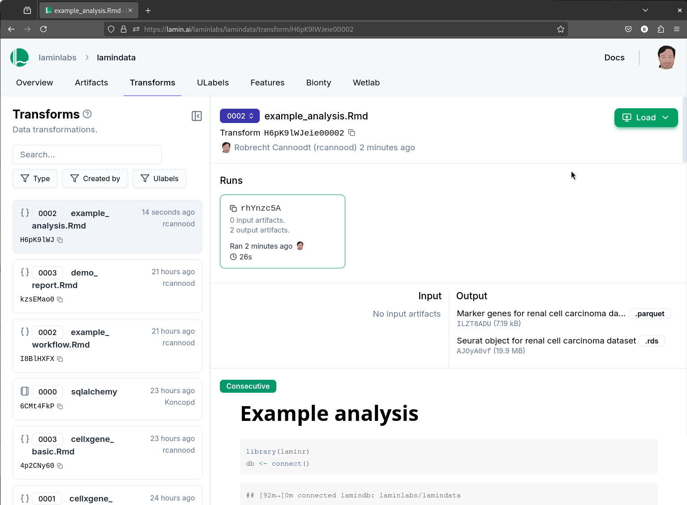

# {laminr} demo

This is a demo of the **{laminr}** package.

## Installation

Follow the installation instructions at https://laminr.lamin.ai. 

## Procedure

Open up `example_analysis.Rmd` in RStudio and run the code chunks.


You can render the report by clicking the "Knit" button.



This will render a report that looks like this:



Finally, you can deploy the report to Lamin by running the following code:

```bash
lamin save example_analysis.Rmd
```

This will deploy the report to Lamin. You can view the report at the URL provided.



## License

This project is licensed under the Apache License 2.0 - see the [LICENSE.md](LICENSE.md) file for details.
